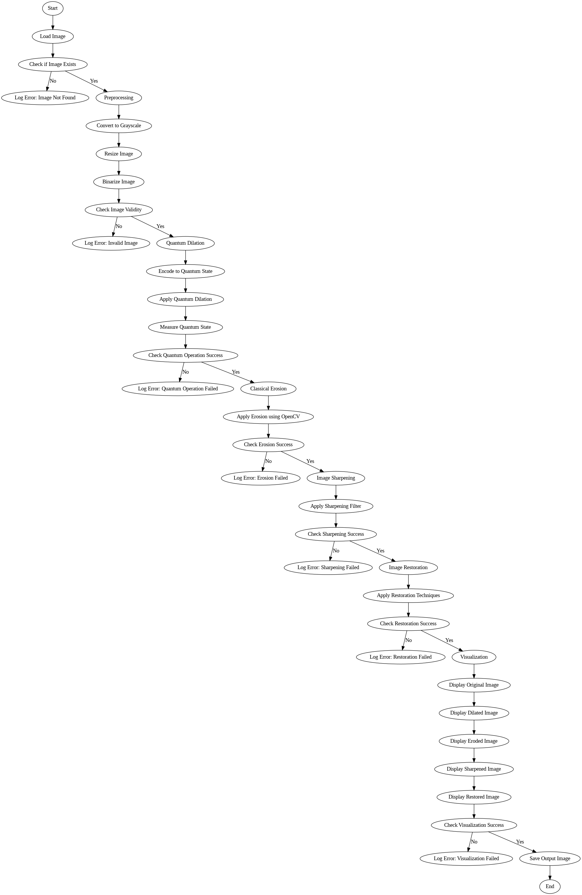
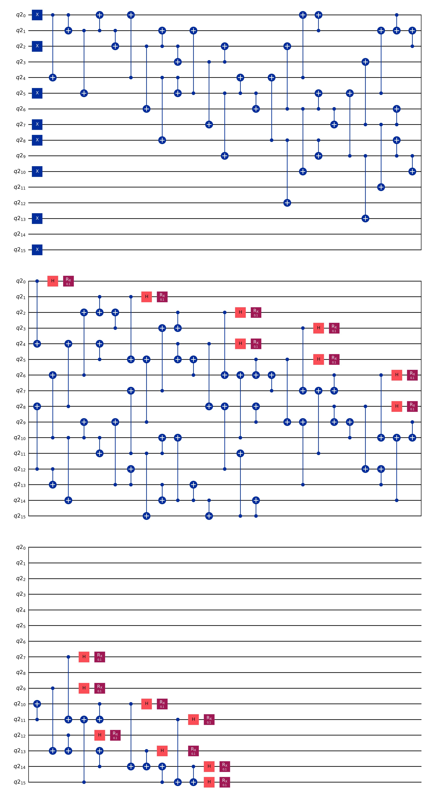

# Quantum Image Morphological Operations

This project leverages quantum computing principles to perform image restoration and sharpening through morphological operations. By combining classical preprocessing with quantum encoding, quantum operations, and classical decoding, this project demonstrates the integration of classical and quantum methodologies for advanced image processing.

## Table of Contents

- [Introduction](#introduction)
- [Problem Definition](#problem-definition)
- [Background and Survey](#background-and-survey)
- [Proposed Methodology](#proposed-methodology)
  - [Architecture and Flow Diagram](#architecture-and-flow-diagram)
  - [Algorithm](#algorithm)
  - [Source Code](#source-code)
- [Requirement Specifications](#requirement-specifications)
- [Installation](#installation)
- [Usage](#usage)
- [Results](#results)
  - [Screenshots](#screenshots)
  - [Analysis](#analysis)
- [Future Scope](#future-scope)
- [Conclusion](#conclusion)
- [Bibliography](#bibliography)
- [Contributors](#contributors)
- [License](#license)

## Introduction

This project aims to explore quantum image processing through morphological operations such as dilation, erosion, image sharpening, and restoration. By leveraging Qiskit for quantum computations and classical image processing libraries like PIL and OpenCV, this project showcases the potential of quantum image processing.

## Problem Definition

The objective is to develop a hybrid classical-quantum approach for performing image morphological operations to enhance and restore images. The challenge is to encode classical image data into a quantum format, apply quantum operations, and decode the results back to classical format efficiently.

## Background and Survey

Quantum image processing (QIP) is a burgeoning field that combines quantum computing and image processing. Classical methods have limitations in terms of computational efficiency and capability to handle large datasets. Quantum computing offers potential advantages with its inherent parallelism and speedup, which can revolutionize image processing tasks.

## Proposed Methodology

### Architecture and Flow Diagram

The project architecture comprises four main stages: Classical Preprocessing, Quantum Encoding, Quantum Operation, and Classical Decoding. Below is a detailed flowchart of the process:



### Algorithm

1. **Load Image:**
   - Convert the input image to grayscale and binary format.
2. **Classical Preprocessing:**
   - Apply classical morphological operations like erosion to preprocess the image.
3. **Quantum Encoding:**
   - Encode the preprocessed image into a quantum state.
4. **Quantum Operation:**
   - Apply quantum gates for dilation, erosion, sharpening, and restoration.
5. **Classical Decoding:**
   - Measure and decode the quantum state back to a classical image format.
6. **Display and Save Results:**
   - Display the original and processed images and save the results.

## Requirement Specifications

- **Software:**

  - Python 3.8+
  - Qiskit
  - PIL (Pillow)
  - OpenCV
  - Matplotlib
  - Graphviz

- **Hardware:**
  - Classical computer with a Python environment.
  - (Optional) Access to IBM Quantum Experience for running on actual quantum hardware.

## Installation

Follow these steps to set up the project environment:

1. **Clone the repository:**

   ```bash
   git clone https://github.com/Souvik-Pramanik/Quantum-Image-Processing.git
   cd quantum-image-processing
   ```

2. **Create and activate a virtual environment (optional but recommended):**

   ```bash
   python -m venv venv
   source venv/bin/activate  # On Windows use `venv\Scripts\activate`
   ```

3. **Install the required libraries:**

   ```bash
   pip install -r requirements.txt
   ```

   The `requirements.txt` file should contain:

   ```text
   qiskit
   numpy
   matplotlib
   pillow
   opencv-python
   graphviz
   ```

4. **Install Graphviz (required for rendering quantum circuit diagrams):**
   - Download and install Graphviz from [here](https://graphviz.gitlab.io/download/).
   - Ensure Graphviz is added to your system's PATH.

## Usage

1. **Prepare your image:**

   - Place the image you want to process in the `images` directory.
   - Update the `image_path` variable in the script with your image's file path.

2. **Run the script:**

   ```bash
   python main.py
   ```

3. **View the results:**
   - The original and processed images will be displayed using Matplotlib.
   - Processed images will be saved in the `output` directory.

## Results

### Quantum Circuit Diagram



### Screenshots

Screenshots of the original and processed images will be saved in the `output` directory and displayed during script execution.

### Analysis

The results demonstrate the effectiveness of quantum morphological operations:

- **Dilation and Erosion:** Quantum circuits successfully expanded and contracted white regions in the binary image.
- **Image Sharpening:** Enhanced image contrast and edge details using Hadamard gates.
- **Image Restoration:** Applied RX gates to smooth and restore pixel values.

## Future Scope

- **Optimization:** Improve the quantum algorithms for better performance and accuracy.
- **Scalability:** Experiment with larger and more complex images.
- **Quantum Hardware:** Test the algorithms on actual quantum hardware to validate the simulation results.

## Conclusion

This project successfully integrates quantum and classical image processing techniques to perform morphological operations, demonstrating the potential of quantum computing in enhancing and restoring images. The results indicate that quantum algorithms can effectively complement classical methods, paving the way for further research and development in quantum image processing.

## Bibliography

- **Books:**
  - Nielsen, M. A., & Chuang, I. L. (2010). _Quantum Computation and Quantum Information_. Cambridge University Press.
- **Conference Papers:**
  - Le, P. Q., Dong, F., & Hirota, K. (2011). A flexible representation of quantum images for polynomial preparation, image compression, and processing operations. _Quantum Information Processing, 10_(1), 63-84.
- **Journal Articles:**
  - Yan, F., Iliyasu, A. M., & Venegas-Andraca, S. E. (2016). A survey of quantum image representations. _Quantum Information Processing, 15_(1), 1-35.
- **URLs:**
  - [Qiskit Documentation](https://qiskit.org/documentation/)
  - [OpenCV Documentation](https://docs.opencv.org/)

## Contributors

- [Souvik Pramanik](https://github.com/Souvik-Pramanik)

## License

This project is licensed under the MIT License - see the [LICENSE](LICENSE) file for details.
